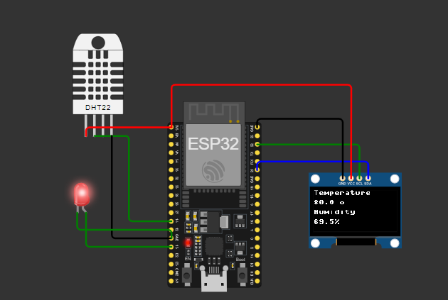

# IoT-Based Temperature and Humidity Display System using ESP32, DHT22 and OLED

This project demonstrates a simple IoT system that monitors and displays temperature and humidity values using an **ESP32 microcontroller**, **DHT22 sensor**, and an **OLED (SSD1306) display**. It is a great entry-level embedded system project to learn real-time data acquisition, sensor interfacing, and display communication using **MicroPython**.

---

## 📷 Circuit Diagram



---

## 🧰 Components Used

- ESP32 Development Board  
- DHT22 Temperature & Humidity Sensor  
- SSD1306 OLED Display (128x64, I2C)  
- Red LED  
- Jumper Wires  
- Breadboard (optional)  

---

## 🧠 Features

- Real-time temperature and humidity monitoring  
- OLED display for live data visualization  
- LED indicator for sensor read status  
- Developed in **MicroPython**

---

## 🚀 Getting Started

1. Flash MicroPython firmware to your ESP32 board.  
2. Upload the code using **Thonny IDE**, **uPyCraft**, or **ampy**.  
3. Connect the hardware as shown in the diagram.  
4. Run the script and view live readings on the OLED display.

---

## 📁 File Structure

```  
📦ESP32-DHT22-OLED
 ┣ 📜 main.py
 ┣ 📷 esp32_dht22_oled_circuit.png
 ┗ 📘 README.md
```
